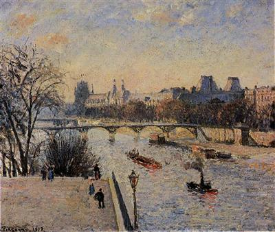
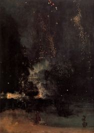
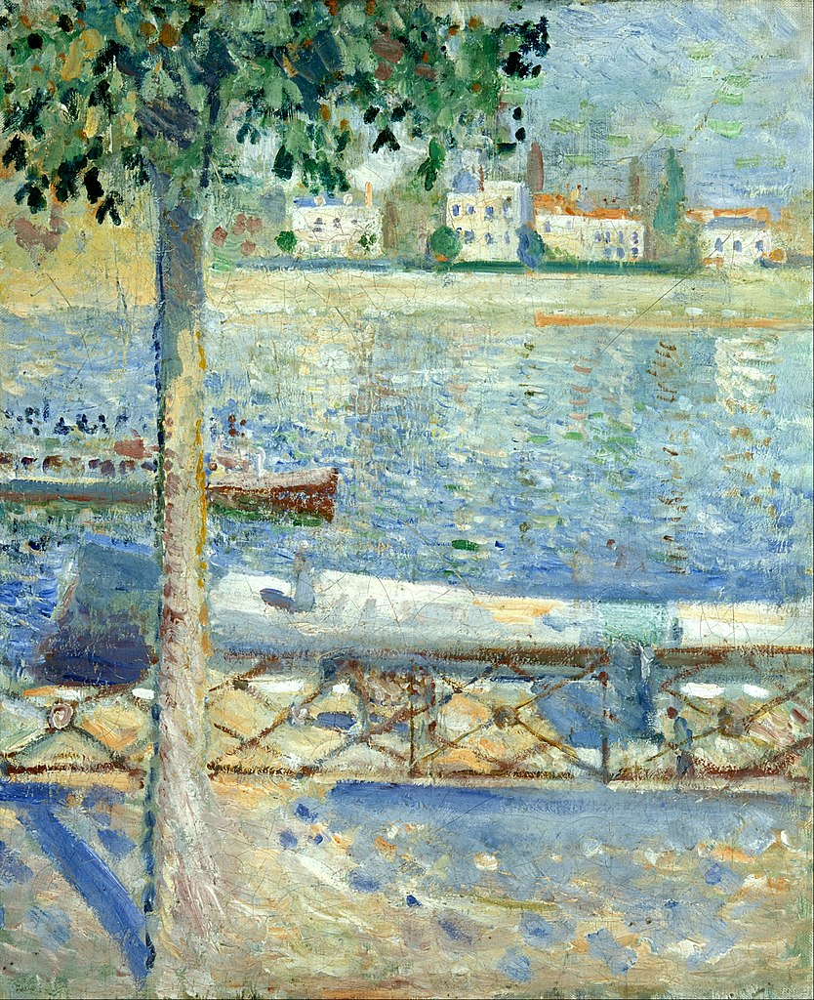

# qwan0810_9103_TUT1

## Individual Code Choices

### Driving Factor: Time
I chose to use time based as the driving force for my personal code to achieve a gradient effect from dusk to night. By recording the start time, the code is able to calculate the progress of the elapsed time and based on this progress it gradually changes the colour of the image to show the transition from sunset to night.

### Animated Properties
In my implementation, the colours of the image are gradually darkened over time, simulating the change from dusk to night. This effect is achieved through an interpolation ( lerpColor ) function that gradually transitions the colours from the original tones to the darker night tones. Unlike the other team members, my animation focuses on colour gradients rather than shape size, interaction or volatility changes.

### Group Members' Choices and Differences
Yiez: Using audio as the driving force, the images flicker to the beat of the drums, creating a rhythmic animation effect.

Tata: Choose User Input that allow the user to travel through the image in 3D, adding a sense of space and immersion.

Yunhao: Perlin noise was used to create dynamic waves and skies, adding a sense of movement to the image.

I chose the time based and used a gradient to contrast with the choices made by the rest of the team to ensure the uniqueness of the animation effect.

### Inspiration and Influence
I am inspired by the natural transition from dusk to night. This gentle, gradual change is characteristic of the Impressionist style of work. I referenced a number of Impressionist images of sunsets and night scenes, which helped me conceptualise the gradual change from bright dusk tones to deep night tones.

Here are some inspiration images

#### The Louvre by Camille Pissarro

#### Nocturne in Black and Gold- The Falling Rocket by James Abbott McNeill Whistler

#### Starry Night Over the Rhône by Vincent van Gogh

#### The Seine at Saint-Cloud by Edvard Munch

### Technical Explanation
In my code implementation, I first record the start time of the programme in the setup() function. Then, in the draw() function, I get the progress by calculating the difference between the current time and the start time. Using the lerpColor function, I was able to smoothly transition between the original colour and the night colour based on that progress. The colour of each rectangle gradually changes over time to the darker tones of the night, simulating the progression from sunset to night.

### Changes to Group Code
In this version, I've added time control variables startTime and transitionTime, and modified the move() method to calculate the colour change of each rectangle based on its progress. In addition, I've added slight random positional offsets and rotations to simulate the brushstroke effect in the Impressionist style, further enhancing the overall dynamic feel.

### External Resources
[This link helps illustrate how the lerpColor function works and provides details on how it is used.](https://p5js.org/reference/p5/lerpColor/)

